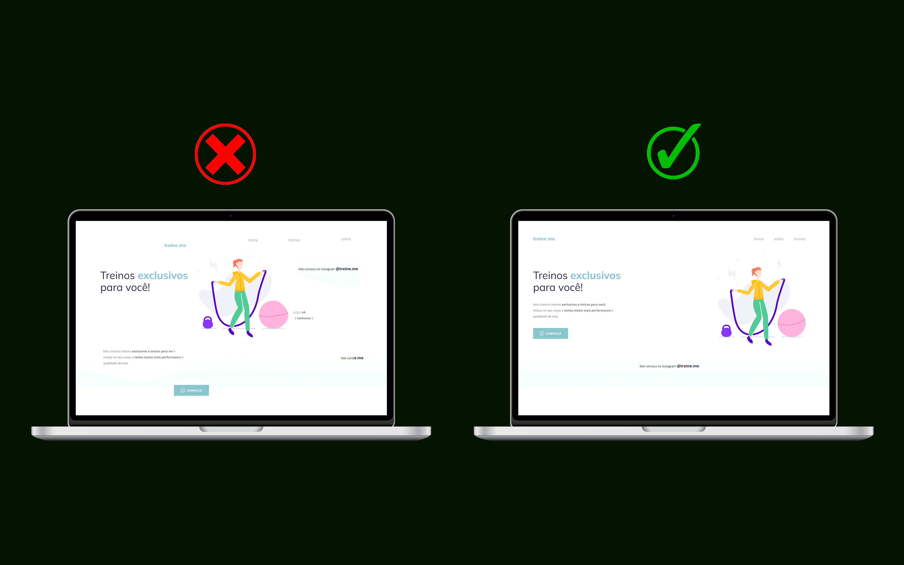

<h1 align="center">Corrigindo Layout do Projeto</h1>

  

  

## 💻 Projeto

CORREÇÃO DE LAYOUT DO PROJETO TREINE ME DA ROCKTSEAT

- [Acesse o projeto](https://explorer3.vercel.app/)

## 🚀 Tecnologias

Esse projeto foi desenvolvido com as seguintes tecnologias:

- HTML e CSS
- Git e Github
- Figma
